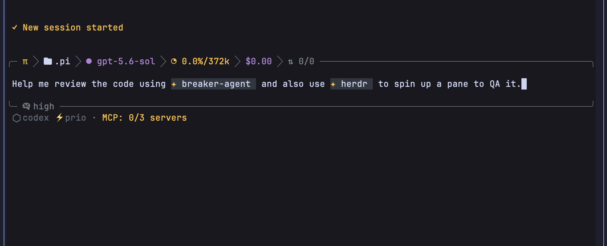

# @esso0428/pi-skill-tags

Inline Pi skills anywhere in a prompt with searchable `$` autocomplete and compact, theme-aware tags.



## Features

- Opens skill autocomplete when you type `$`
- Finds loaded project, global, and temporary skills
- Inserts explicit `$[skill-name]` tags
- Renders known tags as width-preserving TUI chips
- Expands tags into Pi's native skill format on submission
- Loads repeated skills once and combines multiple skills into one invocation
- Leaves unknown or unreadable tags unchanged

## Example

```text
Prompt editor
┌──────────────────────────────────────────────────────────────┐
│ Review this diff with ✦ review-code  then ✦ write-tests     │
└──────────────────────────────────────────────────────────────┘

Submitted prompt
<skill name="review-code + write-tests" location="multiple skills">
  …trusted instructions from both skills…
</skill>

Review this diff with review-code then write-tests
```

The chip is cosmetic. The underlying editor text remains `$[review-code]` or `$[write-tests]`.

## Install

From npm:

```bash
pi install npm:@esso0428/pi-skill-tags
```

From GitHub:

```bash
pi install git:github.com/esso0428/pi-skill-tags
```

From a local checkout:

```bash
pi install ./pi-skill-tags
```

Use `-l` with any `pi install` command for project-local package configuration. Restart Pi or run `/reload` after installation or updates.

## Usage

1. Type `$` in the prompt editor.
2. Continue typing to filter loaded skills.
3. Select a suggestion, or write a tag directly as `$[name]`.
4. Submit the prompt normally.

Autocomplete labels each skill by scope:

- **Project skill** — loaded from the current project's skill directories
- **Global skill** — loaded from user-level skill directories
- **Temporary skill** — loaded only for the current Pi invocation

Multiple tags collapse into one Pi skill invocation. Repeated tags load the skill only once:

```text
Use $[review-code] on this diff, then $[write-tests] for the fix.
```

Unknown tags stay as plain text rather than being removed.

## Compatibility

- Pi `0.80.7` is the currently tested release.
- Node.js `22.19` or newer is required for development and package installation.
- The package declares Pi's coding-agent and TUI APIs as `*` peer dependencies, as required by the Pi package format.

## Security

Skills are trusted instructions. When a tag is submitted, this extension reads that skill and places its instructions in the model context; those instructions can direct the model to run commands or modify files. Review skills and packages before using them. Pi extensions themselves run with full system access.

## Limitations

- Only loaded skills appear in autocomplete.
- Tags use skill names containing letters, numbers, `_`, or `-`.
- Unreadable skill files remain unexpanded.
- The editor integration is intentionally narrow: it wraps only `render()` for cosmetic tag decoration and delegates all other editor behavior to the active editor.

## Development

```bash
npm install
npm run check
npm pack --dry-run
```

Tests use Node's built-in test runner. TypeScript is loaded directly; no build output is published. The npm package allowlist contains only the two runtime source files and public documentation.

To test a checkout in Pi without copying it:

```bash
pi -e ./pi-skill-tags
```

## Release and publishing

1. Update `version` in `package.json` and `package-lock.json`.
2. Add the release notes to `CHANGELOG.md`.
3. Run `npm ci`, `npm run check`, and `npm pack --dry-run`.
4. Create a matching tag such as `v0.1.0`.
5. Push the tag to GitHub. The publish workflow verifies that the tag matches the package version, then publishes with npm provenance and public access.

Configure the GitHub Actions secret `NPM_TOKEN` with an npm granular access token that has **Read and write** permission for `@esso0428/pi-skill-tags` and **Bypass 2FA** enabled. The first scoped publish must permit public access; `publishConfig` and the workflow both enforce it.

## License

[MIT](LICENSE)
